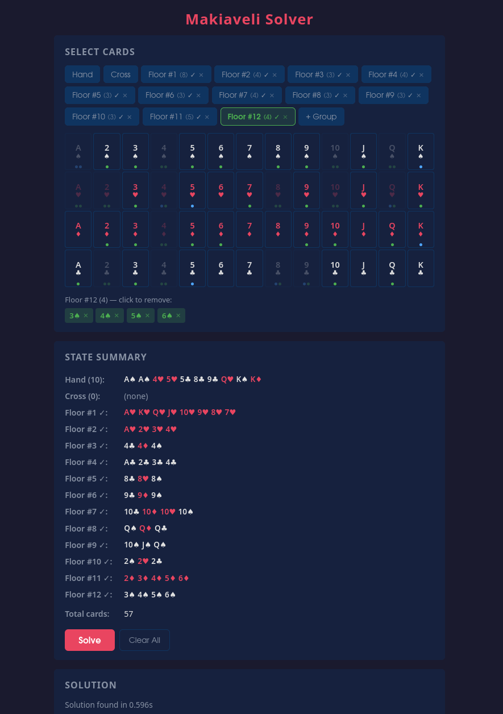

# Makiaveli

A solver and playable game for my favourite card game Makiaveli.

> _In memoriam of my beloved Γιαγια, who taught me this game and was the undisputed champion of figuring out complex plays._

## About Makiaveli

Makiaveli is a Greek card game- a rummy variant where you can rearrange existing plays on the table to make room for your own cards.

## Game Rules

### Setup

- **Decks:** 2 standard decks (104 cards total)
- **Players:** 2+ players (typically 4+)
- **Initial Deal:** Each player receives 5 cards (visible only to them)
- **The Cross:** 4 cards are laid face-up around the remaining deck in a cross formation:
  - One card above the deck
  - One card to the right
  - One card below
  - One card to the left

### Objective

Be the first player to have no cards remaining in your hand.

### Gameplay

Players take turns sequentially. On your turn, you must choose one of two options:

1. **Take a card** from the deck — this ends your turn immediately (you can only draw from the deck, never from the floor)
2. **Make an action** by playing cards

### Making an Action

When making an action, you must:
- Lay down at least one card from your hand (you can play more if desired)
- You may rearrange any cards already on the table (the "floor")
- The final configuration must be valid

### Valid Configurations

All card combinations on the table must follow these rules:

#### Minimum Size
- Every play must contain at least 3 cards

#### Valid Combinations
Cards can be combined in two ways:

1. **Sets (Same Value):** Cards of the same rank but different suits
   - Example: 7♠, 7♥, 7♦ (three 7s of different suits)

2. **Runs (Straight Flush):** Cards of the same suit in consecutive order, no duplicates
   - Example: 5♣, 6♣, 7♣, 8♣
   - Aces are **not** circular: an Ace can come before a 2 OR after a King, but never both in the same run
   - Valid: A♠, 2♠, 3♠ or Q♠, K♠, A♠
   - Invalid: K♠, A♠, 2♠ (wrapping not allowed)

### The Cross

Cross cards start as single face-up cards around the deck. Once you incorporate a cross card into a valid combination (by adding cards from your hand), that combination is treated like any other play on the floor from that point on — it cannot be reverted to its single-card state. Topologically, the cross stays anchored around the deck (one of the resulting combinations occupies each cross position), but from a solver's perspective this distinction is irrelevant.

- Example: If the cross contains 2♠ and you hold 3♠ and 4♠, you can add both cards to form the run 2♠, 3♠, 4♠. From now on, this run follows the same rules as any other play.

### Rearranging the Floor

You may rearrange existing plays on the table, but **only as part of an action where you play at least one card from your hand**. There is no point rearranging without playing a card, since the alternative is taking a card from the deck.

- Take cards from existing combinations to use in new combinations
- Split combinations that have more than 3 cards
- **Critical rule:** The final state must have all valid combinations (each with 3+ cards minimum)
- You cannot leave 1 or 2 cards "hanging" without a valid combination
- Cards on the floor stay on the floor — you can never take a card from the floor back into your hand

### Example Turn

Initial state:
- Cross: 2♠
- Floor: 7♥, 7♦, 7♣ (a set)
- Your hand: 3♠, 4♠, 5♠

Valid action:
- Add 3♠, 4♠, 5♠ to the cross card 2♠ to form: 2♠, 3♠, 4♠, 5♠
- The set of 7s remains unchanged
- All combinations have 3+ cards ✓

## What's in this repo

### Solver

The solver determines whether a player can empty their hand from a given game state. You feed it a hand, the floor groups, and the cross cards, and it tells you if there's a valid play that gets rid of everything.

There's a web UI for it at `/solver` — click cards onto the grid, hit solve.



### Game

Play against a heuristic bot in the browser at `/game`. The bot uses the solver internally to decide its moves, trying the largest possible play first and falling back to drawing.

### Running

```
uv run python server.py
```

Then open `http://localhost:8000` for the landing page.

## Contributing

Pet project to settle debates about whether someone could have won from a particular game state. Contributions welcome!
